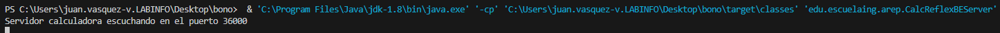
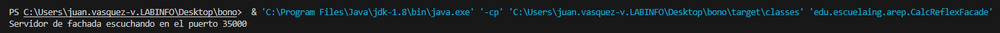
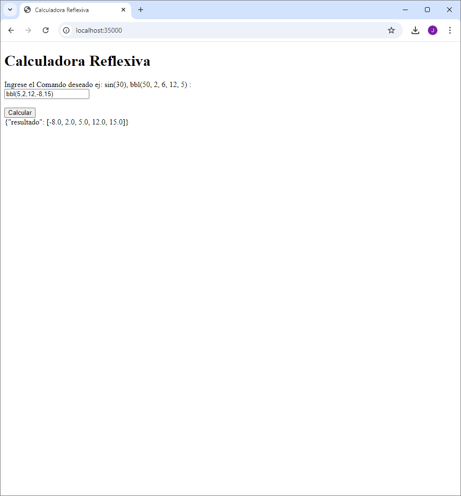

# Bono Parcial


## Getting Started

Download the project from [the repository.](https://github.com/Sebasvasquezz/ArepParcialBono)

### Prerequisites

* [Maven](https://maven.apache.org/): Automate and standardize the lifecycle of software construction.
* [Git](https://www.git-scm.com/): Decentralized Configuration Manager.

### Installing

1. **Maven**
    * Download Maven at http://maven.apache.org/download.html.
    * You need to have Java installed (Java 17 or later recommended).
    * Follow the instructions at http://maven.apache.org/download.html#Installation.

2. **Git**
    * Download Git at https://git-scm.com/download/win.
    * Follow the instructions at https://git-scm.com/book/en/v2/Getting-Started-Installing-Git.

### Running the Application

1. Clone the repository:
    ```bash
    git clone https://github.com/Sebasvasquezz/ArepParcialBono.git

    cd your-repo-directory
    ```

2. Compile the proyect:
    ```sh
    mvn package
    ```

    Deberías ver una salida similar a esta:
    ```sh
    [INFO] Building jar: C:\Users\juan.vasquez-v.LABINFO\Desktop\bono\target\bono-1.0-SNAPSHOT.jar
    [INFO] ------------------------------------------------------------------------
    [INFO] BUILD SUCCESS
    [INFO] ------------------------------------------------------------------------
    [INFO] Total time:  6.834 s
    [INFO] Finished at: 2024-09-19T15:51:09-05:00
    [INFO] ------------------------------------------------------------------------
    ```

3.  Run the facade service in a terminal:
    ```sh
    java -cp target/bono-1.0-SNAPSHOT.jar edu.escuelaing.arep.CalcReflexFacade 
    
    o

    & 'C:\Program Files\Java\jdk-1.8\bin\java.exe' '-cp' 'C:\Users\juan.vasquez-v.LABINFO\Desktop\bono\target\classes' 'edu.escuelaing.arep.CalcReflexFacade'
    ```

    When you run the application, you should see the following:
    
    

    Then run the calculator service in another terminal:

     ```sh
    java -cp target/bono-1.0-SNAPSHOT.jar edu.escuelaing.arep.CalcReflexBEServer 
    
    o

    & 'C:\Program Files\Java\jdk-1.8\bin\java.exe' '-cp' 'C:\Users\juan.vasquez-v.LABINFO\Desktop\bono\target\classes' 'edu.escuelaing.arep.CalcReflexBEServer
    ```
   When you run the application, you should see the following:
    

    
4. Now you can access the following [link](http://localhost:35000/calculadora):
    
5. Enter a math or bbl method, click on calculate and you will get the result::
    

## Built With

* [Maven](https://maven.apache.org/) - Dependency Management
* [Git](http://git-scm.com/) - Version Control System

## Authors

* **Juan Sebastian Vasquez Vega**  - [Sebasvasquezz](https://github.com/Sebasvasquezz)

## Date

September 19, 2024
